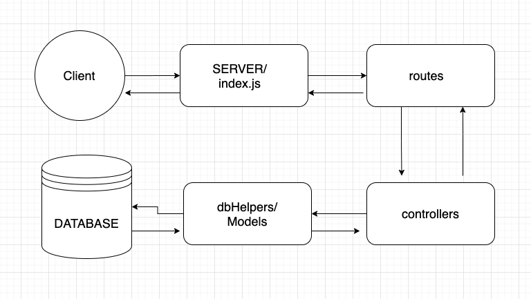

#  Database Review

> A mySQL review repo for practicing connecting a MySQL database to an Express server

###  Usage

```
npm install
```
###  Scripts

`
npm run connect
`
> verify db connection

`npm start`
> start express server

This repo is recommended to be used with `MySQL 8.0`

###  Documentation

*  [MySQL 8.0](https://dev.mysql.com/doc/refman/8.0/en/)


##  Step 1

* Create database `ShopDB` within MySQL

* Establish connection to database in `database/index.js`


##  Step 2

* Create a schema in `database/schema.sql` to describe our `inventory` table

* Run schema file in terminal


##  Step 3

* Create a seeding function in `database/seed.js` to populate table with at least 5 records

* Run seed file in terminal


##  Step 4

* Create dbHelper functions in `database/dbHelpers.js`

- Implement the following CRUD functionality:

  - `Create new record`
  - `Read all records `
  - `Read one record by id`
  - `Update one record`
  - `Delete one record`

* Create controller functions in `server/controllers.js`

* Create routes in `server/router.js`

* Use dbHelper functions within your controller functions


##  Step 5

* Test for working functionality via [Postman](https://www.postman.com/)

##

<br/><br/>



<br/><br/>

> Diagram courtesy of [Jordan Chun](https://github.com/jchun765)


##  MIDDLEWARE UTILIZED:

*  [cors](https://www.npmjs.com/package/cors)

*  [morgan](https://www.npmjs.com/package/morgan)

*  [bodyParser](https://www.npmjs.com/package/body-parser)


##  HELPFUL DOCS

*  [mySQL](https://www.npmjs.com/package/mysql)
*  [Express](https://expressjs.com/)
*  [Queries](http://www.cheat-sheets.org/sites/sql.su/#data_manipulation)